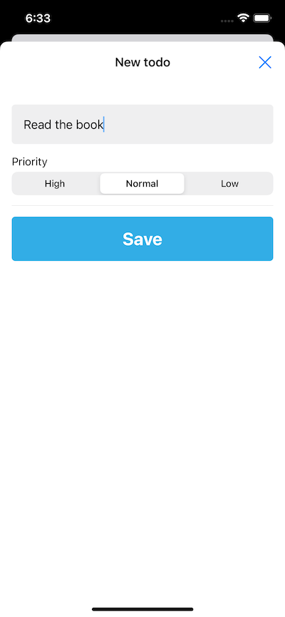
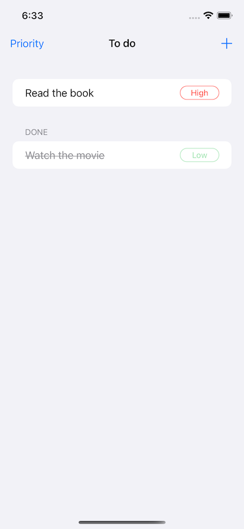
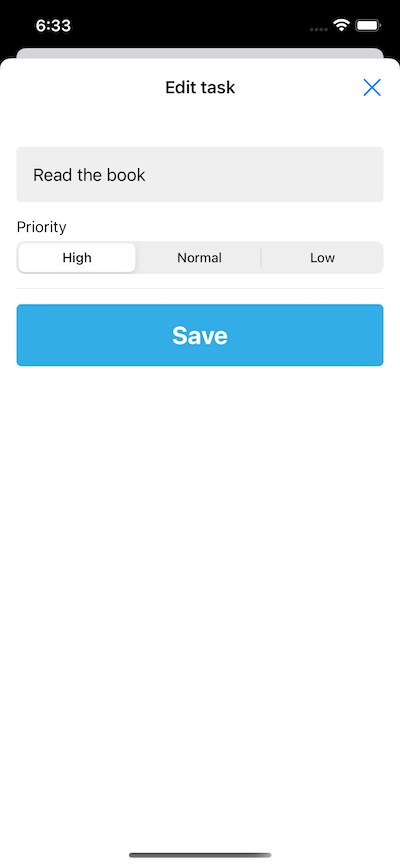
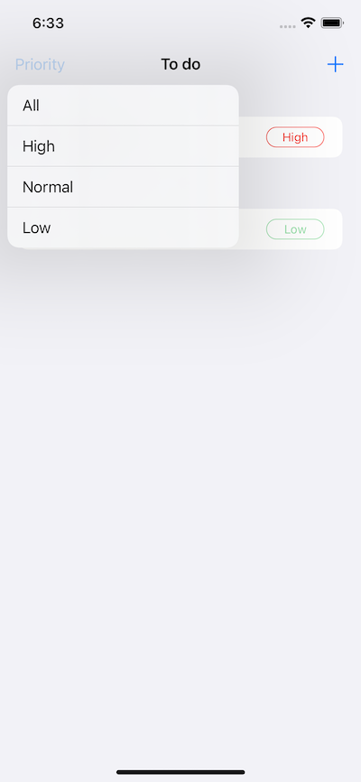
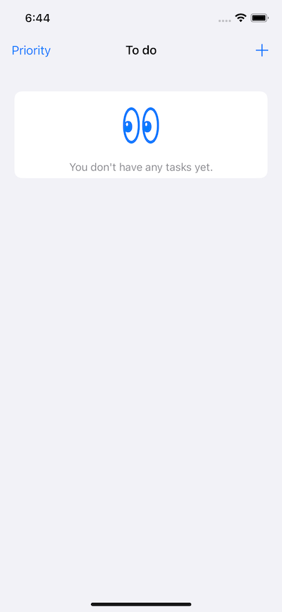
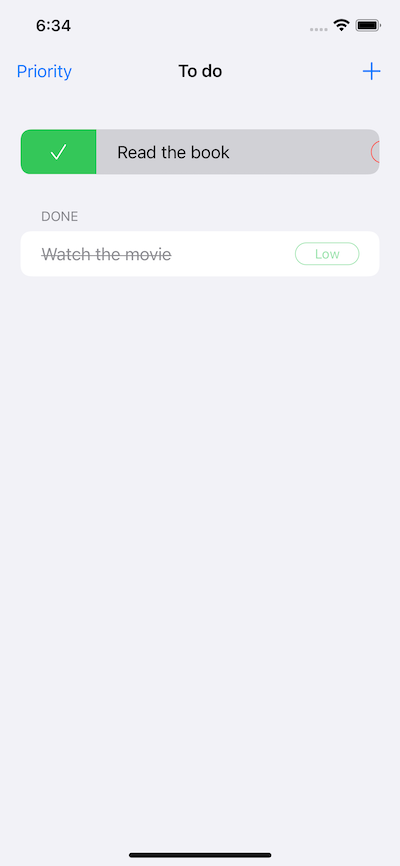
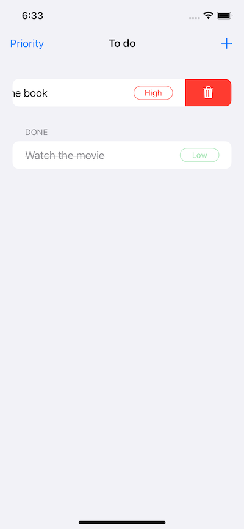

# ToDoList
Simply ToDo application developed using SwiftUI

## Features

- Create task
- Edit task (if not marked as completed)
- Filter tasks by priority
- Delete task

## Built With

* SwiftUI
* CoreData

## Demo

## License

GNU General Public License v3.0
